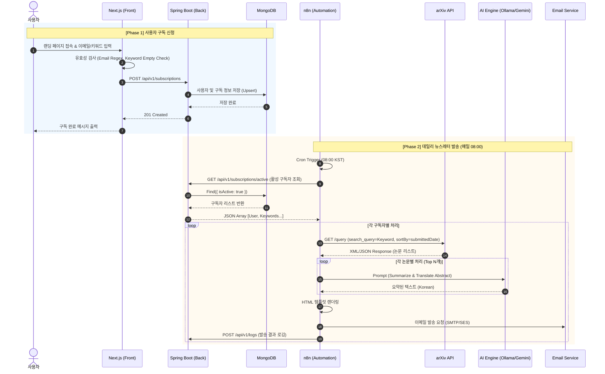

# papercore 소프트웨어 요구사항 명세서 (SRS)

| 항목 | 내용 |
| --- | --- |
| **문서 버전** | 1.0 |
| **작성자** | Lead System Architect |
| **상태** | 승인 대기 (Draft) |
| **날짜** | 2025-05-20 |

---

## 1. 시스템 아키텍처 (System Architecture)

### 1.1 아키텍처 개요
본 시스템은 **Event-Driven 및 Batch Processing** 중심의 아키텍처를 채택합니다. 사용자 인터페이스(Frontend)와 데이터 관리(Backend)는 RESTful API로 느슨하게 결합되며, 핵심 비즈니스 로직인 '논문 수집 및 요약'은 **n8n 오케스트레이션 엔진**을 통해 독립된 워크플로우로 수행됩니다.

- **Frontend (Next.js):** 사용자 접점, 구독 신청 및 관리 UI 제공.
- **Backend (Kotlin Spring Boot):** 사용자 데이터의 SSOT(Single Source of Truth), 구독 정보 관리 API 제공.
- **Database (MongoDB):** 비정형 논문 메타데이터 및 유연한 사용자 구독 스키마 저장.
- **Automation (n8n):** 스케줄러 기반의 배치 작업(ETL + AI Processing) 수행.
- **AI Engine (Ollama/Gemini):** 논문 초록(Abstract) 기반의 요약 및 번역 수행.

### 1.2 데이터 흐름도 (Data Flow Sequence)
아래 다이어그램은 **(1) 사용자 구독 프로세스**와 **(2) 데일리 논문 발송 프로세스**를 나타냅니다.



---

## 2. 기능 요구사항 (Functional Requirements)

### 2.1 Frontend (Next.js)

| ID | 기능명 | 상세 설명 |
| :-- | :-- | :-- |
| **FE-01** | 랜딩 페이지 | 서비스 가치 제안(Value Proposition) 표시, 구독 폼 중심의 UI 구성. |
| **FE-02** | 구독 정보 입력 | 이메일 주소 입력 및 관심 주제(Keyword) 입력 필드 제공 (태그 형태 UI 권장). |
| **FE-03** | 입력 검증 | 이메일 형식(Regex), 키워드 최소 1개 이상 입력 강제. |
| **FE-04** | 구독 처리 UX | API 호출 중 로딩 인디케이터 표시, 성공/실패 시 Toast 메시지 또는 결과 모달 제공. |

### 2.2 Backend (Kotlin Spring Boot)

| ID | 기능명 | 상세 설명 | HTTP Method/Path |
| :-- | :-- | :-- | :-- |
| **BE-01** | 구독 생성/갱신 | 사용자 이메일 기준으로 기존 유저면 업데이트, 신규면 생성 (Upsert). | `POST /api/v1/subscriptions` |
| **BE-02** | 활성 구독자 조회 | n8n 에이전트가 처리할 대상인 '활성 상태'의 구독자 목록 반환. 페이징 처리 권장. | `GET /api/v1/subscriptions/active` |
| **BE-03** | 발송 로그 저장 | n8n에서 발송 성공/실패 여부를 수신하여 DB에 기록. | `POST /api/v1/logs` |
| **BE-04** | 구독 취소 | 이메일 하단 링크를 통한 구독 비활성화 처리. | `DELETE /api/v1/subscriptions/{id}` |

### 2.3 Automation Workflow (n8n)

- **Trigger:** Cron Schedule Node 사용 (매일 08:00 KST).
- **Data Fetching:** Spring Boot API 호출 노드.
- **arXiv Logic:**
    - HTTP Request Node를 사용하여 arXiv API 호출 (`http://export.arxiv.org/api/query`).
    - 검색 쿼리: `cat:cs.AI AND submittedDate:[Yesterday TO Today]` (예시).
    - **중복 필터링:** 이미 발송된 논문 ID(Log 기반) 제외 로직 포함.
- **AI Processing:**
    - Ollama/Gemini Chat Model Node 연결.
    - **입력:** 논문 제목 + 초록 (Abstract).
    - **출력:** 한국어 요약문 (3줄 요약, 핵심 키워드).
- **Emailing:**
    - HTML 템플릿에 AI 요약 결과를 주입.
    - SMTP 또는 Gmail Node를 사용하여 발송.

---

## 3. 데이터베이스 설계 (Database Schema)
MongoDB의 유연성을 활용하여 스키마를 설계합니다.

### 3.1 Users & Subscriptions Collection (`subscriptions`)
사용자와 구독 정보를 단일 문서로 관리하여 조회 성능을 최적화합니다.

```json
{
  "_id": "ObjectId('...')",
  "email": "user@example.com",
  "name": "홍길동",
  "isActive": true,
  "preferences": {
    "keywords": ["Large Language Model", "RAG", "Kotlin"],
    "categories": ["cs.AI", "cs.CL"],
    "frequency": "daily" // daily, weekly
  },
  "createdAt": "2024-05-20T09:00:00Z",
  "updatedAt": "2024-05-20T09:00:00Z"
}
```

### 3.2 Delivery Logs Collection (`logs`)
발송 이력 및 실패 원인 분석을 위한 로그입니다.

```json
{
  "_id": "ObjectId('...')",
  "subscriptionId": "ObjectId('Ref to subscriptions')",
  "email": "user@example.com",
  "sentAt": "2024-05-21T08:00:00Z",
  "status": "SUCCESS", // SUCCESS, FAILED
  "paperIds": ["2405.12345", "2405.67890"], // 금일 발송된 논문 ID 목록
  "errorMsg": null // 실패 시 에러 메시지
}
```

---

## 4. 비기능 요구사항 (Non-functional Requirements)

### 4.1 성능 (Performance)
- **Rate Limiting 준수:** arXiv API는 과도한 요청 시 차단될 수 있습니다. n8n의 **Split In Batches** 및 **Wait** 노드를 사용하여 요청 간 3초 이상의 딜레이를 둡니다.
- **병렬 처리 제어:** AI 모델(Ollama)이 로컬에서 구동될 경우 동시 요청 처리가 어렵습니다. **순차 처리(Sequential Processing)**를 기본으로 하되, Gemini API 사용 시에는 병렬 처리를 허용합니다.

### 4.2 안정성 (Reliability)
- **Retry Policy:** AI 응답 지연(Timeout) 또는 arXiv API 5xx 에러 발생 시, n8n의 **Retry on Fail** 설정을 통해 최대 3회 재시도합니다.
- **Dead Letter Queue:** 3회 재시도 실패 시, 해당 항목을 별도 DB나 파일로 저장하여 추후 수동 처리하거나 관리자에게 알림을 보냅니다.

### 4.3 확장성 (Scalability) & 비용 관리
- **Hybrid AI Strategy:**
    - **Tier 1 (기본):** 비용 절감을 위해 **로컬 Ollama (llama3 또는 gemma)**를 우선 사용.
    - **Tier 2 (부하 시):** 로컬 리소스 점유율이 높거나 처리 속도가 늦어질 경우, 자동으로 **Google Gemini API**로 스위칭하도록 n8n 분기(Switch) 로직 구성.

---

## 5. 핵심 구현 가이드 (Implementation Hints)

### 5.1 n8n - Spring Boot 통신 보안
n8n이 백엔드 API를 호출할 때 보안을 유지하기 위해 **API Key** 방식을 권장합니다.
- **Spring Boot:** RequestHeader 검증 필터 또는 Interceptor 구현.
- **n8n:** HTTP Request Header에 `X-API-KEY: {SECRET_KEY}` 포함.

### 5.2 AI System Prompt (시스템 프롬프트 예시)
AI가 일관된 품질의 요약을 생성하도록 아래와 같이 구조화된 프롬프트를 사용하십시오.

```text
# Role
당신은 컴퓨터 과학 분야의 전문 연구원이자 기술 번역가입니다.

# Task
아래 제공되는 영문 논문의 제목과 초록(Abstract)을 바탕으로, 한국어 독자가 빠르게 핵심을 파악할 수 있도록 요약하십시오.

# Input Data
Title: {{ $json.title }}
Abstract: {{ $json.summary }}

# Constraints
1. **언어:** 반드시 자연스러운 '한국어'로 작성하십시오.
2. **구조:**
   - **한줄 요약:** 논문의 핵심 내용을 1문장으로 요약.
   - **주요 기여:** 논문이 학계에 기여한 점을 3개의 Bullet point로 나열.
   - **기술적 특징:** 사용된 모델, 알고리즘, 데이터셋 등 기술적 키워드 명시.
3. **톤앤매너:** 전문적이고 객관적인 어조를 유지하십시오.

# Output Format (JSON)
{
  "korean_title": "번역된 제목",
  "one_line_summary": "한줄 요약 내용",
  "key_points": ["기여점1", "기여점2", "기여점3"],
  "tech_stack": "사용 기술/모델"
}
```

### 5.3 이메일 템플릿 렌더링 (n8n)
n8n 내에서 HTML을 직접 조합하기보다, MJML 등으로 미리 작성된 HTML 구조에 변수만 치환하는 방식을 사용하십시오.

```html
<!-- 예시 HTML 스니펫 -->
<div class="paper-card">
    <h3>{{ $json.korean_title }} <small>({{ $json.original_title }})</small></h3>
    <p class="summary">{{ $json.one_line_summary }}</p>
    <ul>
        {{ $json.key_points.map(p => `<li>${p}</li>`).join('') }}
    </ul>
    <a href="{{ $json.link }}" class="button">원문 보기</a>
</div>
```
